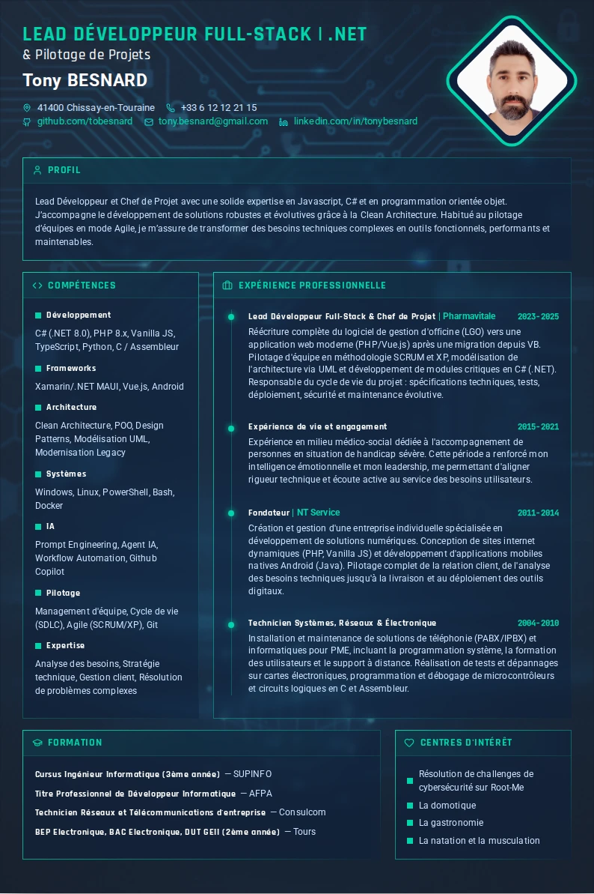

## Paramètrage via l'url

- `?cv=nom_du_cv` permet de switcher vers différent cv 
- `?data` affiche les dates cachées comme les dates des dipômes
- `?interest-first` interchange la position entre les sections centres d'interets et formation
